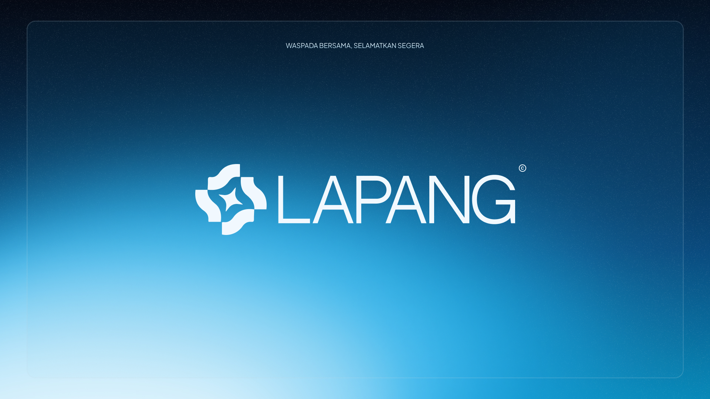
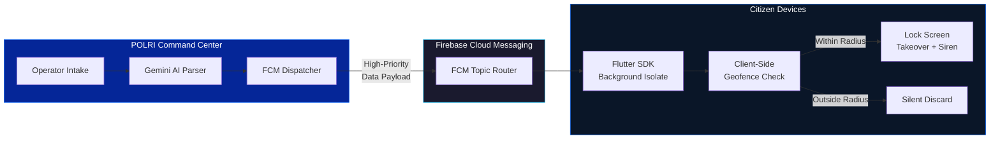
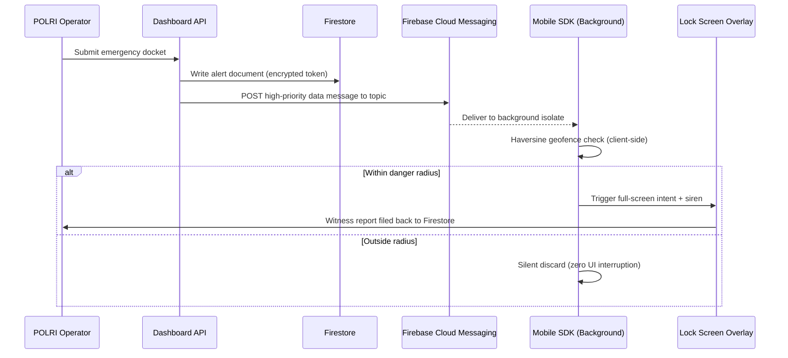

<p align="center">
  
</p>

<p align="center">
  <a href="https://rsvp.withgoogle.com/events/juaravibecoding">
    
  </a>
</p>

<p align="center">
  <strong>LAPoran Anak hilaNG</strong><br/>
  <em>Waspada Bersama, Selamatkan Segera.</em><br/><br/>
  <strong>An official submission for the <a href="https://rsvp.withgoogle.com/events/juaravibecoding">Google Juara Vibe Coding</a> Competition.</strong>
</p>

<p align="center">
  <a href="LICENSE"></a>
  
  
  
</p>

---

<br/>

## The Problem

75% of child abduction cases turn fatal within the first **3 hours**. In Indonesia, two systemic failures make this worse:

**SMS channels are dead.** Class 0 / Flash SMS has been exploited by commercial spam (gambling ads, quota offers) to the point where citizens reflexively dismiss every pop-up without reading it. The medium itself has lost all credibility as an emergency channel.

**Text-only alerts are blind.** Abduction response requires instant visual identification — the child's face, last-known clothing, suspect vehicle type, escape radius. A plain-text message cannot carry this context. By the time a verbal description circulates through traditional channels, the golden window has already closed.

**Bureaucratic myths cost lives.** The widespread misconception that a missing person report requires a 24-hour waiting period delays mobilization at the most critical moment.

<br/>

## What LAPANG Does

LAPANG is an open-source **Localized Emergency Alert Framework** that cuts through institutional delay. It connects a police Command Center dashboard directly to citizens' lock screens within a calculated danger radius — no app download required by the public.

<br/>



<br/>

## Architecture

LAPANG operates as a dual-component system:

### Dashboard — Police Command Center

Built with **Next.js 15** (App Router), deployed as a web application for verified law enforcement operators.

| Capability | Implementation |
|:-----------|:---------------|
| Case intake with rich media | Structured form capturing victim photo, clothing, suspect description, vehicle identifiers |
| Coordinate triangulation | Interactive map pinpointing last-seen location with configurable broadcast radius |
| AI narrative parsing | Google Gemini integration that converts raw witness accounts into structured, scannable alert data |
| FCM dispatch pipeline | Server-side Firebase Admin SDK compiling high-priority data payloads with full-screen intent targeting |
| Anti-fraud tokenization | AES-256-GCM encrypted case IDs preventing public URL enumeration |

### Mobile SDK — System-Level Interrupt Engine

Built with **Flutter**, designed as a standalone SDK that municipal apps (JAKI, Sapawarga, etc.) can integrate with a single initialization call.

| Capability | Implementation |
|:-----------|:---------------|
| Background FCM processing | Dart isolate handles incoming payloads without requiring the app to be open |
| Client-Side Geofencing | Haversine calculation runs locally on-device — no server round-trip, no battery drain, no data cost |
| Lock screen takeover | Android full-screen intent with high-importance notification channel bypasses DND and sleep state |
| Emergency audio broadcast | Native MediaPlayer triggers `siren.aac` at alarm-stream volume via platform MethodChannel |
| Dual-action overlay UX | "Simpan" copies alert details to clipboard and dismisses; "Lapor" opens a structured witness report form |

<br/>

## Project Structure

```
project-flash0/
├── dashboard/                    # Next.js 15 Command Center
│   ├── src/app/
│   │   ├── page.tsx              # Operator dashboard — case management
│   │   ├── simulator/page.tsx    # Citizen device simulator (web preview)
│   │   └── api/
│   │       ├── send-alert/       # FCM dispatch endpoint
│   │       ├── parse-narrative/  # Gemini AI narrative parser
│   │       └── device-token/     # Token registration bridge
│   ├── public/
│   │   ├── alert.aac             # Emergency siren audio
│   │   └── firebase-messaging-sw.js
│   └── .env.example              # Required environment variables
│
├── mobile_sdk/                   # Flutter Standalone SDK
│   ├── lib/
│   │   ├── main.dart             # App entry, UI, alert overlay engine
│   │   └── background_handler.dart  # FCM background isolate processor
│   └── android/
│       └── app/src/main/
│           ├── AndroidManifest.xml   # Permissions, services, receivers
│           ├── java/.../MainActivity.kt      # Native MethodChannel bridge
│           └── java/.../EmergencyReceiver.kt  # Broadcast receiver
│
├── docs/
│   ├── BLUEPRINT.md              # Technical specification
│   └── assets/                   # Logo variants and banner
│
├── LICENSE                       # Apache 2.0
├── CONTRIBUTING.md               # Development setup and guidelines
├── SECURITY.md                   # Vulnerability disclosure policy
├── CODE_OF_CONDUCT.md
└── CHANGELOG.md
```

<br/>

## Data Flow — Alert Lifecycle



<br/>

## Quickstart

### Prerequisites

- Node.js 18+
- Flutter 3.x with Android SDK
- Firebase project with Cloud Messaging enabled
- Google AI Studio API key (optional, for Gemini parser)

### 1. Clone and configure

```bash
git clone https://github.com/fromrha/project-flash0.git
cd project-flash0/dashboard
cp .env.example .env.local
# Fill in your Firebase credentials
```

### 2. Run the Command Center

```bash
npm install
npm run dev
```

Dashboard launches at `http://localhost:3000`. The operator interface and citizen simulator are both accessible from here.

### 3. Build the Mobile SDK

```bash
cd mobile_sdk
flutter pub get
flutter run
```

Requires a physical Android device or emulator with Google Play Services.

<br/>

## Tech Stack

| Layer | Technology | Role |
|:------|:-----------|:-----|
| Command Center | Next.js 15, React 19, TypeScript | Operator dashboard, API routes, simulator |
| Mobile Client | Flutter 3, Dart, Kotlin | Background FCM processing, geofencing, lock screen UI |
| Messaging | Firebase Cloud Messaging (HTTP v1) | High-priority data payload delivery to topic subscribers |
| Database | Cloud Firestore | Alert documents, device tokens, case status tracking |
| AI Parser | Google Gemini 1.5 Flash | Unstructured witness narrative to structured alert data |
| Encryption | AES-256-GCM | Secure token ID generation for public-facing case URLs |
| Audio | Android MediaPlayer (native) | Alarm-stream siren playback via platform MethodChannel |

<br/>

## Firestore Schema

```json
{
  "secure_token_id": "AES-256-GCM encrypted public identifier",
  "internal_case_id": "Auto-generated Firestore document ID",
  "status": "HYBRID_ACTIVE | TERMINATED",
  "victim_info": {
    "name": "String (defaults to 'ANONIM')",
    "age": "Number",
    "last_clothing": "String",
    "photo_url": "CDN reference or null"
  },
  "incident_info": {
    "last_seen_location": "Human-readable landmark",
    "geo_coordinates": "GeoPoint (lat, lng)",
    "radius_km": "Number",
    "suspect_description": "String"
  },
  "ai_summary": "Gemini-compiled short text",
  "timestamps": {
    "created_at": "Timestamp",
    "updated_at": "Timestamp",
    "terminated_at": "Timestamp | null"
  }
}
```

<br/>

## Key Design Decisions

**Why Client-Side Geofencing?**
The Haversine distance calculation runs entirely on the citizen's device. No server round-trip means zero additional latency, zero data cost to the user, and no centralized location tracking. The server broadcasts to a topic — the client decides relevance locally.

**Why a standalone SDK instead of a consumer app?**
Citizens should not need to discover, download, and maintain yet another application. LAPANG is built as an injectable SDK module. Municipal platforms that already have millions of installations (JAKI in Jakarta, Sapawarga in West Java) can integrate the alert engine without requiring any action from their existing user base.

**Why not use SMS or Cell Broadcast?**
Indonesia's SMS channels suffer from carrier-level spam pollution. Class 0 messages are reflexively dismissed. Cell Broadcast infrastructure requires telecom operator cooperation and government-level agreements that create bureaucratic delays incompatible with the 3-hour golden window. FCM high-priority data messages bypass these limitations entirely.

<br/>

## Color System

A "Tactical Mission-Critical Command Center" aesthetic with high contrast and luminous accents.

| Token | Hex | Usage |
|:------|:----|:------|
| Deep Trust Blue | `#052698` | Primary background, authority and security |
| Cyber Electric Blue | `#116BF8` | Interactive elements, focal text, structural highlights |
| Command Center Cyan | `#21BCEE` | Active indicators, geofence visualization, emergency accents |
| Pure Verdict White | `#FFFFFF` | Primary text, high-contrast readability |

<br/>

## Roadmap

- [x] POLRI operator dashboard with structured case intake
- [x] FCM high-priority dispatch pipeline
- [x] Citizen device simulator (web)
- [x] Flutter SDK with background FCM processing
- [x] Client-Side Geofencing (Haversine)
- [x] Android lock screen full-screen intent takeover
- [x] Native siren audio playback via MethodChannel
- [x] Dual-action overlay (Simpan / Lapor)
- [ ] Gemini AI narrative parser integration
- [ ] Dynamic rolling geofence vectoring along suspect trajectories
- [ ] Cryptographic purge protocol (case resolution data wipe)
- [ ] iOS Critical Alert support
- [ ] SDK packaging for municipal app integration

<br/>

## Documentation

| Document | Description |
|:---------|:------------|
| [Technical Blueprint](docs/BLUEPRINT.md) | Full architecture specification, data schemas, and feature classification |
| [Contributing](CONTRIBUTING.md) | Development setup, branching model, and PR guidelines |
| [Security Policy](SECURITY.md) | Vulnerability disclosure and data handling procedures |
| [Changelog](CHANGELOG.md) | Version history and release notes |

<br/>

## License

Licensed under [Apache 2.0](LICENSE). You are free to use, modify, and distribute this framework. Patent protection is included. Attribution is required for derivative works.

```
Copyright 2026 Rahman (project-flash0 / LAPANG)
```

<br/>

---

<p align="center">
  
</p>

<p align="center">
  <sub>An official submission for the <a href="https://rsvp.withgoogle.com/events/juaravibecoding">Google Juara Vibe Coding</a> Competition, Jakarta 2026.</sub><br/>
  <sub><em>Waspada Bersama, Selamatkan Segera.</em></sub>
</p>
